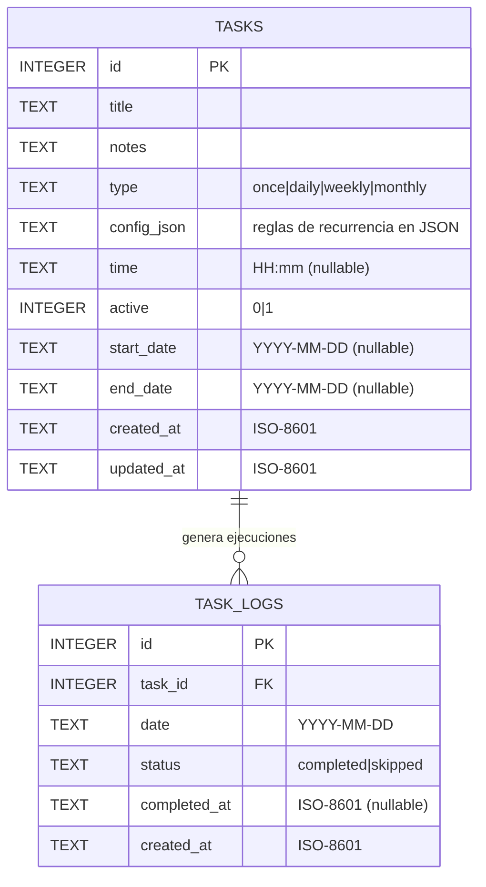

# NeuralFlow - MER (Modelo Entidad-Relacion)

Este MER esta pensado para una app 100% local en celular, usando SQLite.
No hay backend, no hay login, no hay sincronizacion en nube.

## 1) Diagrama ER (Mermaid)



## 2) Entidades

### tasks
Define la plantilla de la tarea (la regla).

Campos recomendados:
- id: PK autoincremental
- title: nombre de tarea
- notes: detalle opcional
- type: once, daily, weekly, monthly
- config_json: configuracion de recurrencia
- time: hora opcional (HH:mm)
- active: 1 activa, 0 inactiva
- start_date: fecha inicio opcional
- end_date: fecha fin opcional
- created_at: timestamp creacion
- updated_at: timestamp actualizacion

### task_logs
Guarda el resultado diario de una tarea (instancia ejecutada).

Campos recomendados:
- id: PK autoincremental
- task_id: FK hacia tasks.id
- date: fecha de la ejecucion (YYYY-MM-DD)
- status: completed o skipped
- completed_at: timestamp cuando se completo (nullable)
- created_at: timestamp de registro

## 3) Relacion principal

- 1 TASK puede tener N TASK_LOGS.
- Un TASK_LOG pertenece a una sola TASK.

## 4) Restricciones clave (muy importante)

1. `UNIQUE(task_id, date)` en task_logs
Evita duplicar registros para la misma tarea en el mismo dia.

2. `CHECK(type IN ('once','daily','weekly','monthly'))` en tasks
Evita tipos invalidos.

3. `CHECK(active IN (0,1))` en tasks
Garantiza booleano en SQLite.

4. `FOREIGN KEY(task_id) REFERENCES tasks(id) ON DELETE CASCADE`
Si borras una tarea, se limpian sus logs.

## 5) Indices recomendados

- `idx_tasks_active` sobre `tasks(active)`
- `idx_task_logs_task_date` sobre `task_logs(task_id, date)`
- `idx_task_logs_date` sobre `task_logs(date)`

Estos indices aceleran pantalla principal e historial.

## 6) Estructura sugerida de config_json

Ejemplos por tipo:

### once
```json
{ "date": "2026-03-20" }
```

### daily
```json
{ "interval": 1 }
```

### weekly
```json
{ "daysOfWeek": [1, 3, 5] }
```

### monthly (dia fijo)
```json
{ "mode": "dayOfMonth", "day": 20 }
```

### monthly (patron)
```json
{ "mode": "pattern", "weekOfMonth": "first", "dayOfWeek": 1 }
```

Valores sugeridos:
- dayOfWeek: 1..7 (1=lunes)
- weekOfMonth: first, second, third, fourth, last

## 7) SQL base de referencia

```sql
CREATE TABLE IF NOT EXISTS tasks (
  id INTEGER PRIMARY KEY AUTOINCREMENT,
  title TEXT NOT NULL,
  notes TEXT,
  type TEXT NOT NULL CHECK(type IN ('once','daily','weekly','monthly')),
  config_json TEXT NOT NULL,
  time TEXT,
  active INTEGER NOT NULL DEFAULT 1 CHECK(active IN (0,1)),
  start_date TEXT,
  end_date TEXT,
  created_at TEXT NOT NULL,
  updated_at TEXT NOT NULL
);

CREATE TABLE IF NOT EXISTS task_logs (
  id INTEGER PRIMARY KEY AUTOINCREMENT,
  task_id INTEGER NOT NULL,
  date TEXT NOT NULL,
  status TEXT NOT NULL CHECK(status IN ('completed','skipped')),
  completed_at TEXT,
  created_at TEXT NOT NULL,
  FOREIGN KEY(task_id) REFERENCES tasks(id) ON DELETE CASCADE,
  UNIQUE(task_id, date)
);

CREATE INDEX IF NOT EXISTS idx_tasks_active
ON tasks(active);

CREATE INDEX IF NOT EXISTS idx_task_logs_task_date
ON task_logs(task_id, date);

CREATE INDEX IF NOT EXISTS idx_task_logs_date
ON task_logs(date);
```

## 8) Notas de implementacion

- Las tareas del dia se generan en memoria segun rules (tasks + config_json).
- task_logs solo guarda estado real (completed/skipped) por fecha.
- Toda la logica es local y funciona sin internet.
